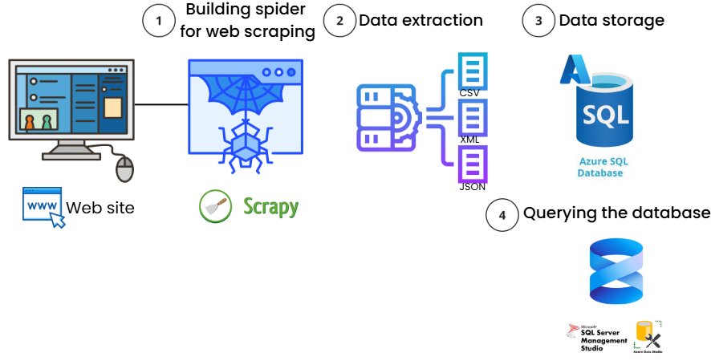
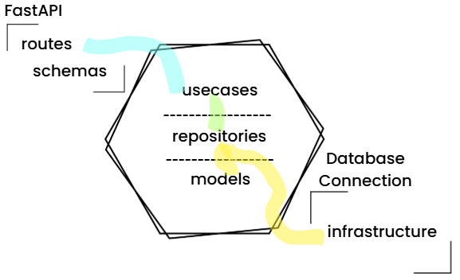
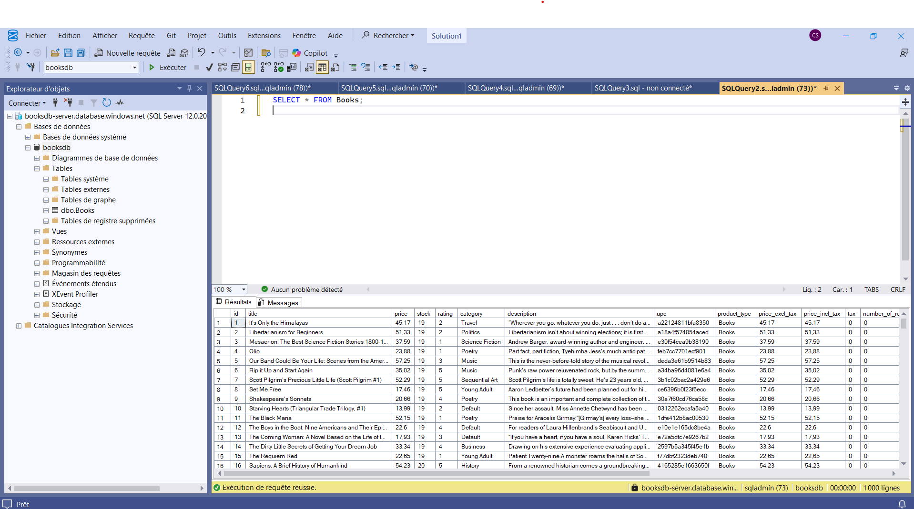

# Web scraping project



webscrapy_project est projet Python qui récupère des données de livres depuis le site web "https://books.toscrape.com/" en utilisant scrapy, les stocke dans un fichier csv, une base de données Sqllite et une **base de données Azure SQL** et les expose via une **API FastAPI** en suivant les principes de l’architecture propre (Clean Architecture).

---

## Table des matières

- [Fonctionnalités](#fonctionnalités)
- [Prérequis](#prérequis)
- [Installation](#installation)
- [Variables d'environnement](#variables-denvironnement)
- [Base de données](#base-de-données)
- [Lancer le projet](#lancer-le-projet)
- [Routes API](#routes-api)
- [Documentation Swagger](#documentation-swagger)
- [Remarques](#remarques)

---

## Fonctionnalités

- Récupération de données de livres depuis le site web "https://books.toscrape.com/".
- Stockage dans une base de données Azure SQL.
- Exposition via une API REST avec FastAPI.
- Structure suivant l'architecture propre (clean architecture) comme représentée dans la figure :  
  - `routers` pour les endpoints API (FastAPI routers)
  - `schemas` pour la validation des données (pydantic)
  - `usecases` pour la logique métier (ex. cas d'utilisation: lister tous les livres)
  - `repositories` pour l'accès aux données (interface entre DB et usecases)
  - `models` pour les modèles ORM (Object-Relational Mapping)
  - `infrastructure` pour la connexion à la base de données
  - main.py          # Point d’entrée de l’api
  - config.py        # Configuration (variables d’environnement, settings)
- Supporte les requêtes suivantes :
  - Lister tous les livres
  - Récupérer un livre par ID
  - Récupérer les livres par catégorie





---

## Prérequis

- Python 3.13+
- FastAPI
- SQLAlchemy
- pyodbc
- Base de données Azure SQL
- ODBC Driver 18 pour SQL Server

---


## Installation

1. Cloner le dépôt :

```
git clone <url_du_depot>
cd webscrapy_project
```

2. Créer et activer un environnement virtuel :

```
python -m venv .venv
.\.venv\Scripts\activate   # Windows
source .venv/bin/activate  # Linux/Mac
```

3. Installer les dépendances :

```
pip install -r requirements.txt
```

## Variables d'environnement

Créer un fichier .env à la racine du projet avec :

```
DB_SERVER=booksdb-server.database.windows.net
DB_NAME=booksdb
DB_USERNAME=sqladmin
DB_PASSWORD=VotreMotDePasseIci
DB_DRIVER={ODBC Driver 18 for SQL Server}
```

## Base de données

1. Se connecter à Azure SQL via SQL Server Management Studio ou pyodbc.

2. Créer la table Books :

```
CREATE TABLE Books (
    id INT IDENTITY(1,1) PRIMARY KEY,
    title NVARCHAR(255),
    price FLOAT,
    stock INT,
    rating INT,
    category NVARCHAR(100),
    description NVARCHAR(MAX),
    upc NVARCHAR(50),
    product_type NVARCHAR(50),
    price_excl_tax FLOAT,
    price_incl_tax FLOAT,
    tax FLOAT,
    number_of_reviews INT,
    availability NVARCHAR(100),
    image_url NVARCHAR(500),
    product_page_url NVARCHAR(500)
);

```
Voici une capture d'écran de SQL Server Management Studio, lors de l'exécution de la requête : " SELECT * FROM Books ; "

---

## Lancer le projet

1. **Lancer le spider** pour récupérer les données des livres et les insérer dans la base de données.  
   Exemple avec Scrapy :

```
scrapy crawl books
```

2. Lancer FastAPI pour exposer les données via l’API :

```
uvicorn myfastapi.main:app --reload

```


Accéder à l’API sur http://127.0.0.1:8000

## API Routes

GET /books/ → List all books (supports limit and offset)
ex: "http://127.0.0.1:8000/books"

GET /books/{book_id} → Get book by ID
ex: "http://127.0.0.1:8000/books/25"

GET /books/category/{category_name} → List books in a category
ex: "http://127.0.0.1:8000/books/category/Thriller"

## Documentation Swagger

Interactive API documentation is available at:

http://127.0.0.1:8000/docs

http://127.0.0.1:8000/redoc


## Remarques

Assurez-vous que le driver ODBC 18 pour SQL Server est installé.

Utilisez le fichier .env pour stocker les informations sensibles.


L’architecture propre (clean architecture) permet de séparer clairement l’API, la logique métier et la base de données.
